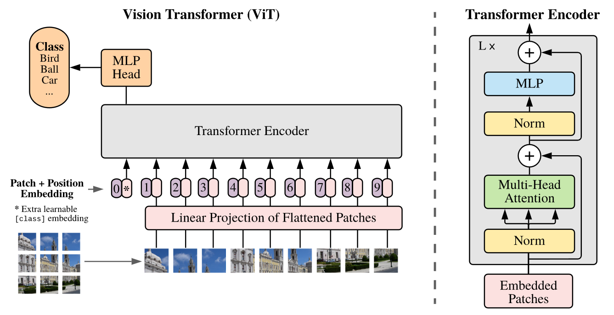

# Vision Transformer

Vision Transformer所做的工作主要是将transformer架构引入到了计算机视觉领域（论文中是图像分类任务），给出了图像怎么转化为序列的一个方案，使得中小尺寸的图片都能利用transformer进行训练和推理。

## Model Architecture



### Embeddings

#### Linear Projection of Flattened Patches

将图像转变为Embedding的一个主要问题就是图像的像素数量太多，如果把每个像素都视作一个token再转变为embedding，所需的计算量是无法接受的。

Vision Transformer(ViT)给出的方案很简单，就是切patch，将一整个图像切成 $P\times P$ 个patch（文章中默认 $P=16$，也就是论文的标题），每个patch的大小是 $(H/P,W/P)$，然后再把每个patch视作一个token，再映射到一个 $D$ 维的向量（embedding）。最后将embeddings展平到一维，这就变成了一个一维的输入序列。

套用论文中的形式，假设输入图像 $\textbf{x}\in\mathbb R^{H\times W\times C}$，然后对图像切patch，划分为 $\textbf{x}_p\in\mathbb R^{N\times(P^2\cdot C)}$，这里 $N=HW/P^2$。

```python
def _process_input(self, x: torch.Tensor) -> torch.Tensor:
    n, c, h, w = x.shape
    p = self.patch_size
    torch._assert(h == self.image_size, f"Wrong image height! Expected {self.image_size} but got {h}!")
    torch._assert(w == self.image_size, f"Wrong image width! Expected {self.image_size} but got {w}!")
    n_h = h // p
    n_w = w // p

    # (n, c, h, w) -> (n, hidden_dim, n_h, n_w)
    x = self.conv_proj(x)
    # (n, hidden_dim, n_h, n_w) -> (n, hidden_dim, (n_h * n_w))
    x = x.reshape(n, self.hidden_dim, n_h * n_w)

    # (n, hidden_dim, (n_h * n_w)) -> (n, (n_h * n_w), hidden_dim)
    # The self attention layer expects inputs in the format (N, S, E)
    # where S is the source sequence length, N is the batch size, E is the
    # embedding dimension
    x = x.permute(0, 2, 1)

    return x
```

这是ViT(torchvision中的实现)中将2D图像转换为embeddings的函数，这里部分参数默认为（以 `vit_b_16` 为baseline）：`hidden_dim = 768`（这个参数就是上文中的向量维度 $D$），`patch_size = 16`，`image_size = 224`（也就是图像大小为 $(224,244,3)$）。然后再看函数流程：

- `conv_proj` 定义为 `nn.Conv2d(in_channels=3, out_channels=hidden_dim, kernel_size=patch_size, stride=patch_size)`，因此 `(n, 3, 224, 224)` 的图像 $\textbf x$ 经过映射后就变成了 `(n, 768, 14, 14)` 的tensor。
- 下一步将图像reshape：`(n, hidden_dim, n_h, n_w) -> (n, hidden_dim, (n_h * n_w))`，根据我们给定的参数，图像变成了 `(n, 768, 196)` 的大小。
- 最后调整维度，返回 `(n, 196, 768)` 的tensor。

#### Learnable Embedding

类似于Bert的 `[class]` token，ViT向上一步得到的embeddings中增加了一个可学习的embedding。这个 `class_token` 定义为

```python
self.class_token = nn.Parameter(torch.zeros(1, 1, hidden_dim))
```

增加 `class_token` 的代码为

```python
# Reshape and permute the input tensor
x = self._process_input(x)
n = x.shape[0]

# Expand the class token to the full batch
batch_class_token = self.class_token.expand(n, -1, -1)
x = torch.cat([batch_class_token, x], dim=1)
```

从上述代码可知，我们先生成了一个 `(1, 1, 768)` 的可学习参数 `class_token`，`batch_class_token` 就是 `class_token` 在第一个维度上复制了 `n` 份（`n = batch_size`）。最后再把 `batch_class_token` 和上一步中求出的embeddings拼接，就得到了我们将要传给encoder的tensor了，该tensor的shape显然为 `(n, 197, 768)`。

根据论文，传给encoder的输入被描述为
$$
\textbf{z}_0=[\textbf x_{\text{class}}; \textbf x_p^1E, \textbf x_p^2E, \ldots;\textbf x_p^NE] + E_{pos}, \quad E\in\mathbb R^{P^2C\times D}, E_{pos}\in\mathbb R^{(N+1)\times D}
$$
注意到，我们还没有提到位置编码 $E_{pos}$。遵循transformer的设计范式，我们将在encoder部分讨论ViT的位置编码。

### Transformer Encoder

ViT是一个encoder only的模型，主体网络中只有transformer encoder，Encoder中每一层与transformer encoder基本一致。

#### Position Embedding

与原始transformer不同，ViT的位置编码采用的是可学习的编码。定义如下：

```python
self.pos_embedding = nn.Parameter(torch.empty(1, seq_length, hidden_dim).normal_(std=0.02))  # from BERT
```

然后将位置编码直接加到模型输入的tensor中

```python
input = input + self.pos_embedding
```

#### Multi-Head Attention

其中Multi-Head Attention(MSA)就是transformer中相同定义的多头注意力层。
$$
\textbf{z}^\prime_l = \text{MSA}(\text{LN}(\textbf z_{l-1})) + \textbf{z}_{l-1},\quad l=1\ldots L
$$

#### MLP

MLP层其实和transformer中的FFN基本一致，都是两个线性层夹一个激活函数，只不过这里用的激活函数是GELU，而非transformer中的ReLU。
$$
\textbf{z}_l = \text{MLP}(\text{LN}(\textbf z_{l})) + \textbf{z}_{l}^\prime,\quad l=1\ldots L
$$
层归一化后得到最终的输出 $\textbf y$：
$$
\textbf y = \text{LN} (\textbf{z}_L^0)
$$

### MLP Head

因为transformer每一层是不会改变模型输入tensor的大小的，所以我们还需要将  `(n, 196, 768)` 的tensor转换为所求问题（图像分类任务）的输出形式。

首先我们先取出经过transformer encoder计算之后的 `class_token`，这也是这个额外的embedding被称为 `[class] token` 的原因，因为ViT认为图像分类信息都用这个embedding储存：

```python
# Classifier "token" as used by standard language architectures
x = x[:, 0]  # (n, 196, 768) -> (n, 768)
```

然后经过一个简单的MLP层，将 `x` 映射到 `(n, nc)` 的大小（nc表示num classes），默认模型是在做ImageNet的分类任务，有1000个类别，因此模型的默认输出就是一个 `(n, 1000)` 的tensor。

这个MLP层的定义如下：

```python
heads_layers: OrderedDict[str, nn.Module] = OrderedDict()
if representation_size is None:
    heads_layers["head"] = nn.Linear(hidden_dim, num_classes)
else:
    heads_layers["pre_logits"] = nn.Linear(hidden_dim, representation_size)
    heads_layers["act"] = nn.Tanh()
    heads_layers["head"] = nn.Linear(representation_size, num_classes)

self.heads = nn.Sequential(heads_layers)
```

如果参数 `representation_size` 未定义，则输出头就是一个将维度从 $D$ 映射到 $nc$ 的线性层。

## Codes

代码完全来源于torchvision

```python
import collections
import math
import torch
import torch.nn as nn
import warnings
from itertools import repeat
from collections import OrderedDict
from functools import partial
from typing import Any, Callable, Dict, List, NamedTuple, Optional, Tuple, Union, Sequence
from types import FunctionType


def _log_api_usage_once(obj: Any) -> None:

    """
    Logs API usage(module and name) within an organization.
    In a large ecosystem, it's often useful to track the PyTorch and
    TorchVision APIs usage. This API provides the similar functionality to the
    logging module in the Python stdlib. It can be used for debugging purpose
    to log which methods are used and by default it is inactive, unless the user
    manually subscribes a logger via the `SetAPIUsageLogger method <https://github.com/pytorch/pytorch/blob/eb3b9fe719b21fae13c7a7cf3253f970290a573e/c10/util/Logging.cpp#L114>`_.
    Please note it is triggered only once for the same API call within a process.
    It does not collect any data from open-source users since it is no-op by default.
    For more information, please refer to
    * PyTorch note: https://pytorch.org/docs/stable/notes/large_scale_deployments.html#api-usage-logging;
    * Logging policy: https://github.com/pytorch/vision/issues/5052;

    Args:
        obj (class instance or method): an object to extract info from.
    """
    module = obj.__module__
    if not module.startswith("torchvision"):
        module = f"torchvision.internal.{module}"
    name = obj.__class__.__name__
    if isinstance(obj, FunctionType):
        name = obj.__name__
    torch._C._log_api_usage_once(f"{module}.{name}")


def _make_ntuple(x: Any, n: int) -> Tuple[Any, ...]:
    """
    Make n-tuple from input x. If x is an iterable, then we just convert it to tuple.
    Otherwise, we will make a tuple of length n, all with value of x.
    reference: https://github.com/pytorch/pytorch/blob/master/torch/nn/modules/utils.py#L8

    Args:
        x (Any): input value
        n (int): length of the resulting tuple
    """
    if isinstance(x, collections.abc.Iterable):
        return tuple(x)
    return tuple(repeat(x, n))


class MLP(torch.nn.Sequential):
    """This block implements the multi-layer perceptron (MLP) module.

    Args:
        in_channels (int): Number of channels of the input
        hidden_channels (List[int]): List of the hidden channel dimensions
        norm_layer (Callable[..., torch.nn.Module], optional): Norm layer that will be stacked on top of the linear layer. If ``None`` this layer won't be used. Default: ``None``
        activation_layer (Callable[..., torch.nn.Module], optional): Activation function which will be stacked on top of the normalization layer (if not None), otherwise on top of the linear layer. If ``None`` this layer won't be used. Default: ``torch.nn.ReLU``
        inplace (bool, optional): Parameter for the activation layer, which can optionally do the operation in-place.
            Default is ``None``, which uses the respective default values of the ``activation_layer`` and Dropout layer.
        bias (bool): Whether to use bias in the linear layer. Default ``True``
        dropout (float): The probability for the dropout layer. Default: 0.0
    """

    def __init__(
        self,
        in_channels: int,
        hidden_channels: List[int],
        norm_layer: Optional[Callable[..., torch.nn.Module]] = None,
        activation_layer: Optional[Callable[..., torch.nn.Module]] = torch.nn.ReLU,
        inplace: Optional[bool] = None,
        bias: bool = True,
        dropout: float = 0.0,
    ):
        # The addition of `norm_layer` is inspired from the implementation of TorchMultimodal:
        # https://github.com/facebookresearch/multimodal/blob/5dec8a/torchmultimodal/modules/layers/mlp.py
        params = {} if inplace is None else {"inplace": inplace}

        layers = []
        in_dim = in_channels
        for hidden_dim in hidden_channels[:-1]:
            layers.append(torch.nn.Linear(in_dim, hidden_dim, bias=bias))
            if norm_layer is not None:
                layers.append(norm_layer(hidden_dim))
            layers.append(activation_layer(**params))
            layers.append(torch.nn.Dropout(dropout, **params))
            in_dim = hidden_dim

        layers.append(torch.nn.Linear(in_dim, hidden_channels[-1], bias=bias))
        layers.append(torch.nn.Dropout(dropout, **params))

        super().__init__(*layers)
        _log_api_usage_once(self)


class MLPBlock(MLP):
    """Transformer MLP block."""

    _version = 2

    def __init__(self, in_dim: int, mlp_dim: int, dropout: float):
        super().__init__(in_dim, [mlp_dim, in_dim], activation_layer=nn.GELU, inplace=None, dropout=dropout)

        for m in self.modules():
            if isinstance(m, nn.Linear):
                nn.init.xavier_uniform_(m.weight)
                if m.bias is not None:
                    nn.init.normal_(m.bias, std=1e-6)

    def _load_from_state_dict(
        self,
        state_dict,
        prefix,
        local_metadata,
        strict,
        missing_keys,
        unexpected_keys,
        error_msgs,
    ):
        version = local_metadata.get("version", None)

        if version is None or version < 2:
            # Replacing legacy MLPBlock with MLP. See https://github.com/pytorch/vision/pull/6053
            for i in range(2):
                for type in ["weight", "bias"]:
                    old_key = f"{prefix}linear_{i+1}.{type}"
                    new_key = f"{prefix}{3*i}.{type}"
                    if old_key in state_dict:
                        state_dict[new_key] = state_dict.pop(old_key)

        super()._load_from_state_dict(
            state_dict,
            prefix,
            local_metadata,
            strict,
            missing_keys,
            unexpected_keys,
            error_msgs,
        )


class ConvNormActivation(torch.nn.Sequential):
    def __init__(
        self,
        in_channels: int,
        out_channels: int,
        kernel_size: Union[int, Tuple[int, ...]] = 3,
        stride: Union[int, Tuple[int, ...]] = 1,
        padding: Optional[Union[int, Tuple[int, ...], str]] = None,
        groups: int = 1,
        norm_layer: Optional[Callable[..., torch.nn.Module]] = torch.nn.BatchNorm2d,
        activation_layer: Optional[Callable[..., torch.nn.Module]] = torch.nn.ReLU,
        dilation: Union[int, Tuple[int, ...]] = 1,
        inplace: Optional[bool] = True,
        bias: Optional[bool] = None,
        conv_layer: Callable[..., torch.nn.Module] = torch.nn.Conv2d,
    ) -> None:

        if padding is None:
            if isinstance(kernel_size, int) and isinstance(dilation, int):
                padding = (kernel_size - 1) // 2 * dilation
            else:
                _conv_dim = len(kernel_size) if isinstance(kernel_size, Sequence) else len(dilation)
                kernel_size = _make_ntuple(kernel_size, _conv_dim)
                dilation = _make_ntuple(dilation, _conv_dim)
                padding = tuple((kernel_size[i] - 1) // 2 * dilation[i] for i in range(_conv_dim))
        if bias is None:
            bias = norm_layer is None

        layers = [
            conv_layer(
                in_channels,
                out_channels,
                kernel_size,
                stride,
                padding,
                dilation=dilation,
                groups=groups,
                bias=bias,
            )
        ]

        if norm_layer is not None:
            layers.append(norm_layer(out_channels))

        if activation_layer is not None:
            params = {} if inplace is None else {"inplace": inplace}
            layers.append(activation_layer(**params))
        super().__init__(*layers)
        _log_api_usage_once(self)
        self.out_channels = out_channels

        if self.__class__ == ConvNormActivation:
            warnings.warn(
                "Don't use ConvNormActivation directly, please use Conv2dNormActivation and Conv3dNormActivation instead."
            )


class Conv2dNormActivation(ConvNormActivation):
    """
    Configurable block used for Convolution2d-Normalization-Activation blocks.

    Args:
        in_channels (int): Number of channels in the input image
        out_channels (int): Number of channels produced by the Convolution-Normalization-Activation block
        kernel_size: (int, optional): Size of the convolving kernel. Default: 3
        stride (int, optional): Stride of the convolution. Default: 1
        padding (int, tuple or str, optional): Padding added to all four sides of the input. Default: None, in which case it will be calculated as ``padding = (kernel_size - 1) // 2 * dilation``
        groups (int, optional): Number of blocked connections from input channels to output channels. Default: 1
        norm_layer (Callable[..., torch.nn.Module], optional): Norm layer that will be stacked on top of the convolution layer. If ``None`` this layer won't be used. Default: ``torch.nn.BatchNorm2d``
        activation_layer (Callable[..., torch.nn.Module], optional): Activation function which will be stacked on top of the normalization layer (if not None), otherwise on top of the conv layer. If ``None`` this layer won't be used. Default: ``torch.nn.ReLU``
        dilation (int): Spacing between kernel elements. Default: 1
        inplace (bool): Parameter for the activation layer, which can optionally do the operation in-place. Default ``True``
        bias (bool, optional): Whether to use bias in the convolution layer. By default, biases are included if ``norm_layer is None``.

    """

    def __init__(
        self,
        in_channels: int,
        out_channels: int,
        kernel_size: Union[int, Tuple[int, int]] = 3,
        stride: Union[int, Tuple[int, int]] = 1,
        padding: Optional[Union[int, Tuple[int, int], str]] = None,
        groups: int = 1,
        norm_layer: Optional[Callable[..., torch.nn.Module]] = torch.nn.BatchNorm2d,
        activation_layer: Optional[Callable[..., torch.nn.Module]] = torch.nn.ReLU,
        dilation: Union[int, Tuple[int, int]] = 1,
        inplace: Optional[bool] = True,
        bias: Optional[bool] = None,
    ) -> None:

        super().__init__(
            in_channels,
            out_channels,
            kernel_size,
            stride,
            padding,
            groups,
            norm_layer,
            activation_layer,
            dilation,
            inplace,
            bias,
            torch.nn.Conv2d,
        )


class ConvStemConfig(NamedTuple):
    out_channels: int
    kernel_size: int
    stride: int
    norm_layer: Callable[..., nn.Module] = nn.BatchNorm2d
    activation_layer: Callable[..., nn.Module] = nn.ReLU


class EncoderBlock(nn.Module):
    """Transformer encoder block."""

    def __init__(
        self,
        num_heads: int,
        hidden_dim: int,
        mlp_dim: int,
        dropout: float,
        attention_dropout: float,
        norm_layer: Callable[..., torch.nn.Module] = partial(nn.LayerNorm, eps=1e-6),
    ):
        super().__init__()
        self.num_heads = num_heads

        # Attention block
        self.ln_1 = norm_layer(hidden_dim)
        self.self_attention = nn.MultiheadAttention(hidden_dim, num_heads, dropout=attention_dropout, batch_first=True)
        self.dropout = nn.Dropout(dropout)

        # MLP block
        self.ln_2 = norm_layer(hidden_dim)
        self.mlp = MLPBlock(hidden_dim, mlp_dim, dropout)

    def forward(self, input: torch.Tensor):
        torch._assert(input.dim() == 3, f"Expected (batch_size, seq_length, hidden_dim) got {input.shape}")
        x = self.ln_1(input)
        x, _ = self.self_attention(x, x, x, need_weights=False)
        x = self.dropout(x)
        x = x + input

        y = self.ln_2(x)
        y = self.mlp(y)
        return x + y


class Encoder(nn.Module):
    """Transformer Model Encoder for sequence to sequence translation."""

    def __init__(
        self,
        seq_length: int,
        num_layers: int,
        num_heads: int,
        hidden_dim: int,
        mlp_dim: int,
        dropout: float,
        attention_dropout: float,
        norm_layer: Callable[..., torch.nn.Module] = partial(nn.LayerNorm, eps=1e-6),
    ):
        super().__init__()
        # Note that batch_size is on the first dim because
        # we have batch_first=True in nn.MultiAttention() by default
        self.pos_embedding = nn.Parameter(torch.empty(1, seq_length, hidden_dim).normal_(std=0.02))  # from BERT
        self.dropout = nn.Dropout(dropout)
        layers: OrderedDict[str, nn.Module] = OrderedDict()
        for i in range(num_layers):
            layers[f"encoder_layer_{i}"] = EncoderBlock(
                num_heads,
                hidden_dim,
                mlp_dim,
                dropout,
                attention_dropout,
                norm_layer,
            )
        self.layers = nn.Sequential(layers)
        self.ln = norm_layer(hidden_dim)

    def forward(self, input: torch.Tensor):
        torch._assert(input.dim() == 3, f"Expected (batch_size, seq_length, hidden_dim) got {input.shape}")
        input = input + self.pos_embedding
        return self.ln(self.layers(self.dropout(input)))


class VisionTransformer(nn.Module):
    """Vision Transformer as per https://arxiv.org/abs/2010.11929."""

    def __init__(
        self,
        image_size: int,
        patch_size: int,
        num_layers: int,
        num_heads: int,
        hidden_dim: int,
        mlp_dim: int,
        dropout: float = 0.0,
        attention_dropout: float = 0.0,
        num_classes: int = 1000,
        representation_size: Optional[int] = None,
        norm_layer: Callable[..., torch.nn.Module] = partial(nn.LayerNorm, eps=1e-6),
        conv_stem_configs: Optional[List[ConvStemConfig]] = None,
    ):
        super().__init__()
        _log_api_usage_once(self)
        torch._assert(image_size % patch_size == 0, "Input shape indivisible by patch size!")
        self.image_size = image_size
        self.patch_size = patch_size
        self.hidden_dim = hidden_dim
        self.mlp_dim = mlp_dim
        self.attention_dropout = attention_dropout
        self.dropout = dropout
        self.num_classes = num_classes
        self.representation_size = representation_size
        self.norm_layer = norm_layer

        if conv_stem_configs is not None:
            # As per https://arxiv.org/abs/2106.14881
            seq_proj = nn.Sequential()
            prev_channels = 3
            for i, conv_stem_layer_config in enumerate(conv_stem_configs):
                seq_proj.add_module(
                    f"conv_bn_relu_{i}",
                    Conv2dNormActivation(
                        in_channels=prev_channels,
                        out_channels=conv_stem_layer_config.out_channels,
                        kernel_size=conv_stem_layer_config.kernel_size,
                        stride=conv_stem_layer_config.stride,
                        norm_layer=conv_stem_layer_config.norm_layer,
                        activation_layer=conv_stem_layer_config.activation_layer,
                    ),
                )
                prev_channels = conv_stem_layer_config.out_channels
            seq_proj.add_module(
                "conv_last", nn.Conv2d(in_channels=prev_channels, out_channels=hidden_dim, kernel_size=1)
            )
            self.conv_proj: nn.Module = seq_proj
        else:
            self.conv_proj = nn.Conv2d(
                in_channels=3, out_channels=hidden_dim, kernel_size=patch_size, stride=patch_size
            )

        seq_length = (image_size // patch_size) ** 2

        # Add a class token
        self.class_token = nn.Parameter(torch.zeros(1, 1, hidden_dim))
        seq_length += 1

        self.encoder = Encoder(
            seq_length,
            num_layers,
            num_heads,
            hidden_dim,
            mlp_dim,
            dropout,
            attention_dropout,
            norm_layer,
        )
        self.seq_length = seq_length

        heads_layers: OrderedDict[str, nn.Module] = OrderedDict()
        if representation_size is None:
            heads_layers["head"] = nn.Linear(hidden_dim, num_classes)
        else:
            heads_layers["pre_logits"] = nn.Linear(hidden_dim, representation_size)
            heads_layers["act"] = nn.Tanh()
            heads_layers["head"] = nn.Linear(representation_size, num_classes)

        self.heads = nn.Sequential(heads_layers)

        if isinstance(self.conv_proj, nn.Conv2d):
            # Init the patchify stem
            fan_in = self.conv_proj.in_channels * self.conv_proj.kernel_size[0] * self.conv_proj.kernel_size[1]
            nn.init.trunc_normal_(self.conv_proj.weight, std=math.sqrt(1 / fan_in))
            if self.conv_proj.bias is not None:
                nn.init.zeros_(self.conv_proj.bias)
        elif self.conv_proj.conv_last is not None and isinstance(self.conv_proj.conv_last, nn.Conv2d):
            # Init the last 1x1 conv of the conv stem
            nn.init.normal_(
                self.conv_proj.conv_last.weight, mean=0.0, std=math.sqrt(2.0 / self.conv_proj.conv_last.out_channels)
            )
            if self.conv_proj.conv_last.bias is not None:
                nn.init.zeros_(self.conv_proj.conv_last.bias)

        if hasattr(self.heads, "pre_logits") and isinstance(self.heads.pre_logits, nn.Linear):
            fan_in = self.heads.pre_logits.in_features
            nn.init.trunc_normal_(self.heads.pre_logits.weight, std=math.sqrt(1 / fan_in))
            nn.init.zeros_(self.heads.pre_logits.bias)

        if isinstance(self.heads.head, nn.Linear):
            nn.init.zeros_(self.heads.head.weight)
            nn.init.zeros_(self.heads.head.bias)

    def _process_input(self, x: torch.Tensor) -> torch.Tensor:
        n, c, h, w = x.shape
        p = self.patch_size
        torch._assert(h == self.image_size, f"Wrong image height! Expected {self.image_size} but got {h}!")
        torch._assert(w == self.image_size, f"Wrong image width! Expected {self.image_size} but got {w}!")
        n_h = h // p
        n_w = w // p

        # (n, c, h, w) -> (n, hidden_dim, n_h, n_w)
        x = self.conv_proj(x)
        # (n, hidden_dim, n_h, n_w) -> (n, hidden_dim, (n_h * n_w))
        x = x.reshape(n, self.hidden_dim, n_h * n_w)

        # (n, hidden_dim, (n_h * n_w)) -> (n, (n_h * n_w), hidden_dim)
        # The self attention layer expects inputs in the format (N, S, E)
        # where S is the source sequence length, N is the batch size, E is the
        # embedding dimension
        x = x.permute(0, 2, 1)

        return x

    def forward(self, x: torch.Tensor):
        # Reshape and permute the input tensor
        x = self._process_input(x)
        n = x.shape[0]

        # Expand the class token to the full batch
        batch_class_token = self.class_token.expand(n, -1, -1)
        x = torch.cat([batch_class_token, x], dim=1)

        x = self.encoder(x)

        # Classifier "token" as used by standard language architectures
        x = x[:, 0]

        x = self.heads(x)

        return x


vit_b_16 = VisionTransformer(
    image_size=224,
    patch_size=16,
    num_layers=12,
    num_heads=12,
    hidden_dim=768,
    mlp_dim=3072,
)
```

