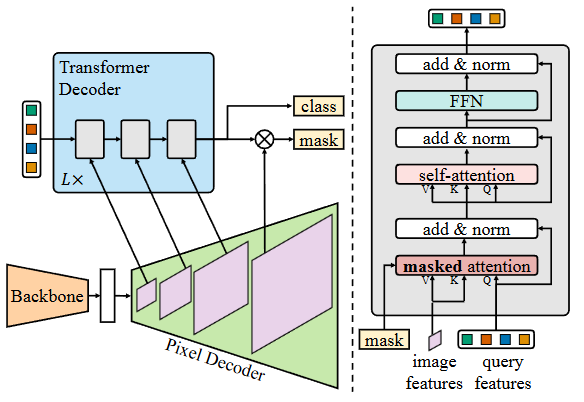

# Mask2Former

## 摘要翻译（GPT）

图像分割将具有不同语义的像素分组，例如类别或实例成员身份。每种语义选择定义一个任务。尽管各任务的语义不同，当前的研究主要集中在为每个任务设计专门的架构。我们提出了Masked-attention Mask Transformer（Mask2Former），一种新的架构，能够处理任何图像分割任务（全景分割、实例分割或语义分割）。其关键组件包括遮罩注意力，通过在预测的遮罩区域内限制跨注意力，提取局部特征。除了将研究工作量至少减少三倍外，Mask2Former在四个流行数据集上显著超越了最优秀的专用架构。最值得注意的是，Mask2Former在全景分割（COCO数据集上达到57.8 PQ）、实例分割（COCO数据集上达到50.1 AP）和语义分割（ADE20K数据集上达到57.7 mIoU）方面设立了新的最先进的纪录。

## 核心创新点

总的来说，Mask2Former是一种在图像分割领域的综合模型，可以支持语义分割、实例分割和全景分割。

文章提出了一种针对图像的Mask Attention。

## Mask2Former

### Architecture

Mask2Former的架构主要由Backbone、Pixel Decoder、Transformer Decoder以及输出头构成。其中Transformer Decoder的masked attention是本文的创新点之一，后文会详细解释。

此外，这里的Transformer Decoder与经典的Transformer Decoder设计有所不同，但不是重点，略去。

### Masked attention

按照论文中的描述，一个标准的cross-attention（with residual path）的形式是
$$
\mathbf{X}_l = \mathrm{softmax}(\mathbf{Q}_l \mathbf{K}_l^{\mathrm{T}}) \mathbf{V}_l + \mathbf{X}_{l-1}.
$$
这里 $\mathbf{X}_l$ 表示第 $l$ 个decoder layer的输出。

而文中提出的masked attention就是
$$
\mathbf{X}_l = \mathrm{softmax}(\mathcal{M}_{l-1} + \mathbf{Q}_l \mathbf{K}_l^{\mathrm{T}}) \mathbf{V}_l + \mathbf{X}_{l-1}.
$$
其中
$$
\mathcal{M}_{l-1}(x, y) =
\begin{cases}
    0 & \text{if } \mathbf{M}_{l-1}(x, y) = 1, \\
    -\infty & \text{otherwise}.
\end{cases}
$$
而 $\mathbf{M}_{l-1}$ 表示第 $l-1$ 层decoder layer输出的mask预测。具体地，用一个阈值（文中是 $0.5$）将decoder前一层输出的mask转换为0-1矩阵。

实际上就是告诉模型当前decoder layer只关注前一层decoder layer预测出的mask所在范围（非mask区域归零）。

### High-resolution features

这部分就是模型中Pixel Decoder到Transformer Decoder的特征金字塔结构，Mask2Former会将不同尺度的特征图一层层地传到Transformer Decoder中。具体地，Pixel Decoder会生成原始图像分辨率 $1/32,1/16,1/8$ 的特征图，并且为每个特征图生成了正弦位置编码 $e_{pos}\in\mathbb R^{H_lW_l\times C}$，和一个可学习的scale-level embedding $e_{lvl}\in\mathbb R^{1\times C}$。

### Implementation details

#### Pixel Decoder

Pixel Decoder的架构采用了可变形注意力机制（MSDeformAttn），每一种不同尺寸的特征图都采用了6层MSDeformAttn layer，并通过带有横向连接的简单上采样层生成最终的 $1/4$ 特征图，并与transformer decoder的最终输出结合以得到mask的输出。

#### Transformer decoder

如架构图所示，Mask2Former的transformer decoder主要有三个block，每个block内部堆叠了3层decoder layer，因此模型一共有9层decoder layer。

#### Loss

模型的loss主要由两部分构成：

1. mask loss：$L_{mask}=\lambda_{ce}L_{ce}+\lambda_{dice}L_{dice}$，ce loss是每一个像素点的二分类交叉熵loss。$\lambda_{ce}=\lambda_{dice}=5.0$
2. cls loss：$\lambda_{cls}L_{cls}$，$\lambda_{cls}=2$，对于“no object”类，额外乘一个 $0.1$ 的惩罚因子，以减轻负例的影响。