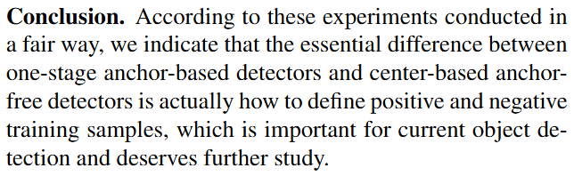
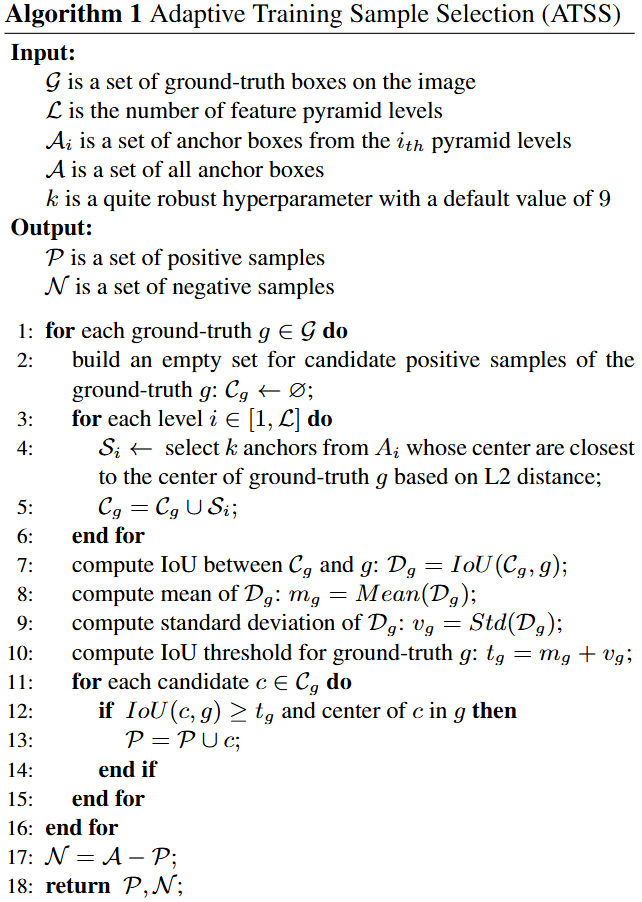

# ATSS

[论文](https://arxiv.org/abs/1912.02424)

## 摘要（GPT）

目标检测多年来一直由基于锚点的检测器主导。最近，由于提出了 FPN 和 Focal Loss，基于点（anchor-free）的检测器逐渐变得流行。在本文中，我们首先指出，基于锚点和基于点的检测方法之间的根本区别实际上在于如何定义正负训练样本，这导致了它们之间的性能差距。如果它们在训练过程中采用相同的正负样本定义，无论是回归框还是回归点，最终的性能不会有明显的差异。这表明，如何选择正负训练样本对当前的目标检测器非常重要。接着，我们提出了一种自适应训练样本选择方法（ATSS），通过根据物体的统计特征自动选择正负样本。这显著提高了基于锚点和基于点的检测器的性能，并弥合了它们之间的差距。最后，我们讨论了在图像上每个位置使用多个锚点来检测物体的必要性。在 MS COCO 数据集上进行的大量实验支持了我们前述的分析和结论。通过新引入的 ATSS，我们将最先进的检测器的性能大幅提升，达到了 50.7% 的 AP，且没有引入额外的开销。代码可在以下网址获取：https://github.com/sfzhang15/ATSS。

## 核心创新点

比较了以RetinaNet为代表的Anchor-based方法和以FCOS为代表的Anchor-free方法，并给出了本文的核心推论：Anchor-based方法和Anchor-free方法的差距实际上是在正例/负例匹配这一过程中产生的。

于是本文提出了一种新的正例/负例匹配算法Adaptive Training Sample Selection（ATSS）。

## ATSS

1. 对于每个GT box $g$，首先建一个空集 $\mathcal C_g \leftarrow \varnothing$ 用于存储所有的候选正例。（下方流程都针对这个GT box $g$ 进行）
2. 对于每一层特征图 $i$，根据 $L2$ 距离，选择模型对于该特征图像生成的所有预测框中距离GT box $g$ 的中心最近的top-k个，并将这些预测框加入 $\mathcal C_g$。
3. 计算候选框集 $\mathcal C_g$ 和GT box $g$ 之间的IoU：$\mathcal D_g = IoU(\mathcal C_g,g)$，计算 $\mathcal D_g$ 的均值 $m_g = Mean(\mathcal D_g)$；计算 $\mathcal D_g$ 的标准差：$v_g = Std(\mathcal D_g)$；计算IoU阈值 $t_g=m_g+v_g$。
4. 对于候选框集 $\mathcal C_g$ 中的每一个候选框，如果某个候选框和GT box $g$ 的IoU大于等于阈值 $t_g$，并且这个框的中心位于 $g$ 的内部，则这个框就被认为是一个正例。
5. 完成每一个GT box $g$ 的枚举之后剩下的预测框就是负例。

