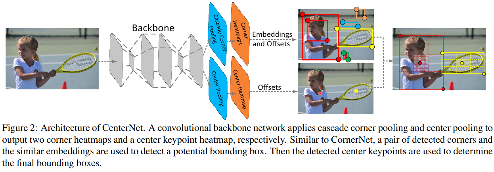
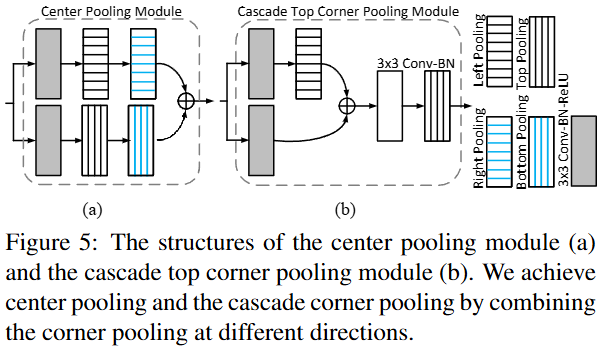
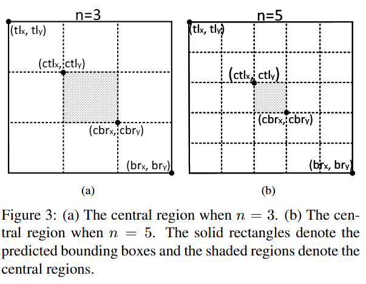

# CenterNet

## 摘要翻译（GPT）

在目标检测中，基于关键点的方法通常会遇到大量不正确的目标边界框，这可能是由于缺乏对裁剪区域的额外关注。本文提出了一种高效的解决方案，通过最小的计算成本探索每个裁剪区域内的视觉模式。我们基于一个代表性的单阶段关键点检测器——CornerNet，构建了我们的框架。我们的方法，命名为CenterNet，将每个目标检测为一个三元组，而不是一个二元组的关键点，这提高了精度和召回率。因此，我们设计了两个定制化模块，分别为级联角点池化（cascade corner pooling）和中心池化（center pooling），它们分别起到丰富左上角和右下角收集的信息，以及在中心区域提供更具可识别性信息的作用。 在MS-COCO数据集上，CenterNet达到了47.0%的AP，至少比所有现有的单阶段检测器高出4.9%。同时，CenterNet在推理速度上更快，且在性能上与排名靠前的两阶段检测器相当。代码可以在 https://github.com/Duankaiwen/CenterNet 获取。

## 核心创新点

本文基本上可以认为是[CornerNet](../CornerNet/cornernet.md)的优化，CenterNet发现了CornerNet将bbox视作左上角和右下角点对的问题：只考虑这两个角点实际上很大程度上只考虑了物体的边缘，忽略了物体的内部特征，因此本文加入了一个中心分支，用于提取物体的中心特征。

## CenterNet

### Architecture



模型架构如上图所示，基本上就是在CornerNet的基础上添加了一个center分支

### Center Pool

```python
class pool_cross(nn.Module):
    def __init__(self, dim, pool1, pool2, pool3, pool4):
        super(pool_cross, self).__init__()
        self.p1_conv1 = convolution(3, dim, 128)
        self.p2_conv1 = convolution(3, dim, 128)

        self.p_conv1 = nn.Conv2d(128, dim, (3, 3), padding=(1, 1), bias=False)
        self.p_bn1   = nn.BatchNorm2d(dim)

        self.conv1 = nn.Conv2d(dim, dim, (1, 1), bias=False)
        self.bn1   = nn.BatchNorm2d(dim)
        self.relu1 = nn.ReLU(inplace=True)

        self.conv2 = convolution(3, dim, dim)

        self.pool1 = pool1()
        self.pool2 = pool2()
        self.pool3 = pool3()
        self.pool4 = pool4()

    def forward(self, x):
        # pool 1
        p1_conv1 = self.p1_conv1(x)
        pool1    = self.pool1(p1_conv1)
        pool1    = self.pool3(pool1)

        # pool 2
        p2_conv1 = self.p2_conv1(x)
        pool2    = self.pool2(p2_conv1)
        pool2    = self.pool4(pool2)

        # pool 1 + pool 2
        p_conv1 = self.p_conv1(pool1 + pool2)
        p_bn1   = self.p_bn1(p_conv1)

        conv1 = self.conv1(x)
        bn1   = self.bn1(conv1)
        relu1 = self.relu1(p_bn1 + bn1)

        conv2 = self.conv2(relu1)
        return conv2

class center_pool(pool_cross):
    def __init__(self, dim):
        super(center_pool, self).__init__(dim, TopPool, LeftPool, BottomPool, RightPool)
```

可以类比top-left pool和bottom-right pool，center pool实际上就是同时叠加了四个方向的pool。结构图如下：



### Center Keypoints

这一部分详细解释了CenterNet是怎么将corner points和center points结合起来。

1. 根据分数选择出top-k center keypoints
2. 使用相应的offsets将这些center keypoints重新映射到输入图像的原始坐标
3. 对于corner points匹配出的每个bbox定义一个中心区域，检查center keypoints是否在这个中心区域内
4. 如果在中心区域检测到center keypoints，保留该边界框。边界框的分数将替换为三个点（即左上角、右下角和中心关键点）的平均分数。如果在其中心区域没有检测到中心关键点，则边界框将被删除。

#### 中心区域的定义



如图，对于小bbox，我们定义的中心区域如(a)图；对于大bbox，我们定义的中心区域如(b)图。也就是根据大小决定切成 $3\times 3$ 还是 $5\times 5$。