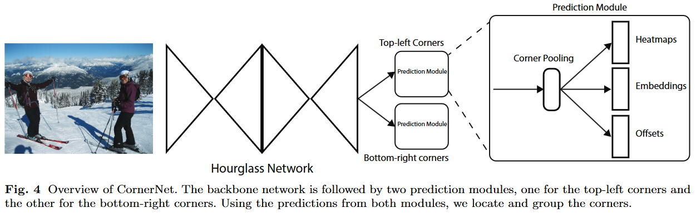
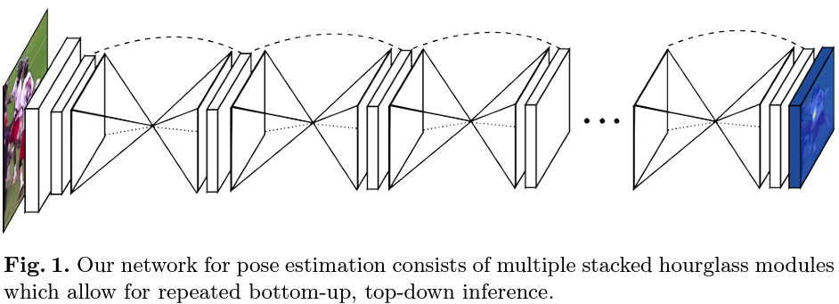
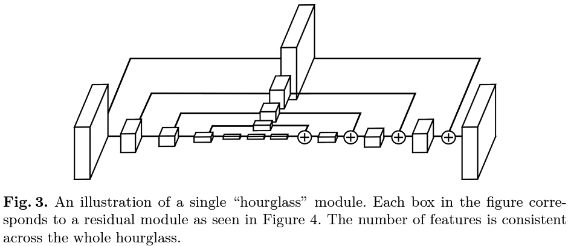
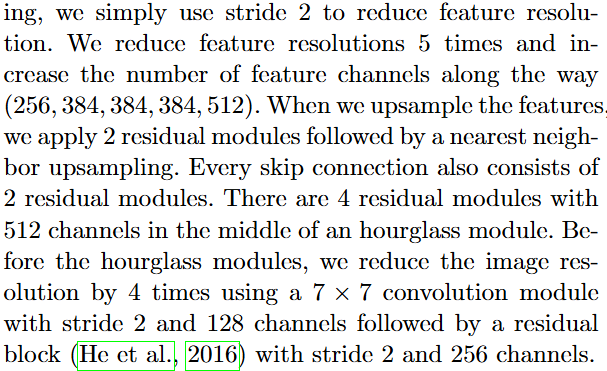
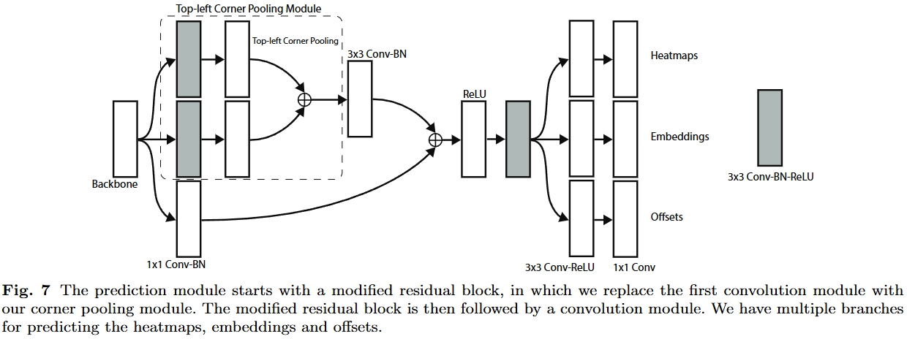
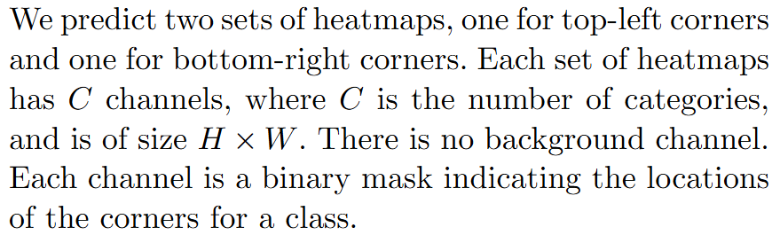
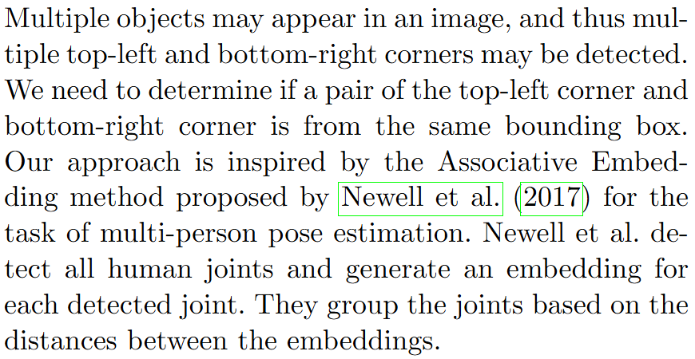
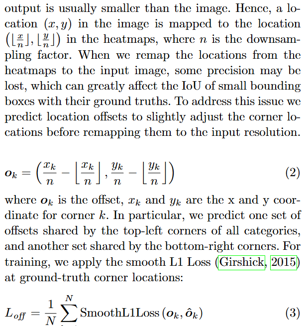

# CornerNet

## 摘要翻译（GPT）

我们提出了CornerNet，一种新的目标检测方法，该方法通过使用单一卷积神经网络，将目标的边界框检测为一对关键点——左上角和右下角。通过将目标检测为成对的关键点，我们避免了在先前的单阶段检测器中常用的锚点框设计需求。除了这一创新的公式化方法，我们还引入了**角池化**（corner pooling），一种新的池化层类型，帮助网络更好地定位角点。实验结果表明，CornerNet在MS COCO上达到了42.2%的AP，超过了所有现有的单阶段检测器。

## 核心创新点

在目标检测中，模型一般都需要给出预测目标的边界框，这个边界框一般都是平行于2D图像边界的矩形，本文将矩形框的预测视作预测这个框的左上角与右下角这两个角点。因此这是一种anchor-free的目标检测器。

## CornerNet

### 架构



CornerNet的结构图如上，backbone是一个Hourglass Network，可以认为是两段沙漏形状的CNN；预测头是两个完全相同的分支，其中一个用于预测左上角，另一个用于预测右下角；每一个预测头会将backbone提取出的features通过一个corner pooling模块后转化为heatmaps、embeddings和offsets。

#### Hourglass Network

Hourglass Network出自[论文Hourglass Network](https://arxiv.org/abs/1603.06937)，总体结构图如下



其中一个沙漏型模块的结构图如下，



直接看原始论文的[实现](https://github.com/princeton-vl/pytorch_stacked_hourglass/blob/master/models/layers.py)：

```python
from torch import nn

Pool = nn.MaxPool2d

def batchnorm(x):
    return nn.BatchNorm2d(x.size()[1])(x)

class Conv(nn.Module):
    def __init__(self, inp_dim, out_dim, kernel_size=3, stride = 1, bn = False, relu = True):
        super(Conv, self).__init__()
        self.inp_dim = inp_dim
        self.conv = nn.Conv2d(inp_dim, out_dim, kernel_size, stride, padding=(kernel_size-1)//2, bias=True)
        self.relu = None
        self.bn = None
        if relu:
            self.relu = nn.ReLU()
        if bn:
            self.bn = nn.BatchNorm2d(out_dim)

    def forward(self, x):
        assert x.size()[1] == self.inp_dim, "{} {}".format(x.size()[1], self.inp_dim)
        x = self.conv(x)
        if self.bn is not None:
            x = self.bn(x)
        if self.relu is not None:
            x = self.relu(x)
        return x
    
class Residual(nn.Module):
    def __init__(self, inp_dim, out_dim):
        super(Residual, self).__init__()
        self.relu = nn.ReLU()
        self.bn1 = nn.BatchNorm2d(inp_dim)
        self.conv1 = Conv(inp_dim, int(out_dim/2), 1, relu=False)
        self.bn2 = nn.BatchNorm2d(int(out_dim/2))
        self.conv2 = Conv(int(out_dim/2), int(out_dim/2), 3, relu=False)
        self.bn3 = nn.BatchNorm2d(int(out_dim/2))
        self.conv3 = Conv(int(out_dim/2), out_dim, 1, relu=False)
        self.skip_layer = Conv(inp_dim, out_dim, 1, relu=False)
        if inp_dim == out_dim:
            self.need_skip = False
        else:
            self.need_skip = True
        
    def forward(self, x):
        if self.need_skip:
            residual = self.skip_layer(x)
        else:
            residual = x
        out = self.bn1(x)
        out = self.relu(out)
        out = self.conv1(out)
        out = self.bn2(out)
        out = self.relu(out)
        out = self.conv2(out)
        out = self.bn3(out)
        out = self.relu(out)
        out = self.conv3(out)
        out += residual
        return out 

class Hourglass(nn.Module):
    def __init__(self, n, f, bn=None, increase=0):
        super(Hourglass, self).__init__()
        nf = f + increase
        self.up1 = Residual(f, f)
        # Lower branch
        self.pool1 = Pool(2, 2)
        self.low1 = Residual(f, nf)
        self.n = n
        # Recursive hourglass
        if self.n > 1:
            self.low2 = Hourglass(n-1, nf, bn=bn)
        else:
            self.low2 = Residual(nf, nf)
        self.low3 = Residual(nf, f)
        self.up2 = nn.Upsample(scale_factor=2, mode='nearest')

    def forward(self, x):
        up1  = self.up1(x)
        pool1 = self.pool1(x)
        low1 = self.low1(pool1)
        low2 = self.low2(low1)
        low3 = self.low3(low2)
        up2  = self.up2(low3)
        return up1 + up2
```

不难发现，这个Hourglass module的实现是用递归定义的大型残差块，每一层用max pool将图像大小折半，然后通过一些大小不变的卷积层，最后再通过上采样层还原图像大小。

而本文的backbone就是两个堆叠的Hourglass module，虽然相比较原文略有变化，但是变化不大，这里略去，具体变化如下图原文。



代码实现见[该文件](https://github.com/princeton-vl/CornerNet/blob/master/models/py_utils/kp.py)中的 `kp_module`。

#### Prediction Module

让我们再看一下论文原文中给出的细节结构图：



图像经过backbone后得到的feature map会被送入两个相同的分支，也就是左上角/右下角的预测头。我们先来看看模型的[前向传播代码](https://github.com/princeton-vl/CornerNet/blob/master/models/py_utils/kp.py#L166)：

```python
def _train(self, *xs):
    image   = xs[0]
    tl_inds = xs[1]
    br_inds = xs[2]

    inter = self.pre(image)
    outs  = []

    layers = zip(
        self.kps, self.cnvs,
        self.tl_cnvs, self.br_cnvs,
        self.tl_heats, self.br_heats,
        self.tl_tags, self.br_tags,
        self.tl_regrs, self.br_regrs
    )
    for ind, layer in enumerate(layers):
        kp_, cnv_          = layer[0:2]
        tl_cnv_, br_cnv_   = layer[2:4]
        tl_heat_, br_heat_ = layer[4:6]
        tl_tag_, br_tag_   = layer[6:8]
        tl_regr_, br_regr_ = layer[8:10]

        kp  = kp_(inter)
        cnv = cnv_(kp)

        tl_cnv = tl_cnv_(cnv)
        br_cnv = br_cnv_(cnv)

        tl_heat, br_heat = tl_heat_(tl_cnv), br_heat_(br_cnv)
        tl_tag,  br_tag  = tl_tag_(tl_cnv),  br_tag_(br_cnv)
        tl_regr, br_regr = tl_regr_(tl_cnv), br_regr_(br_cnv)

        tl_tag  = _tranpose_and_gather_feat(tl_tag, tl_inds)
        br_tag  = _tranpose_and_gather_feat(br_tag, br_inds)
        tl_regr = _tranpose_and_gather_feat(tl_regr, tl_inds)
        br_regr = _tranpose_and_gather_feat(br_regr, br_inds)

        outs += [tl_heat, br_heat, tl_tag, br_tag, tl_regr, br_regr]

        if ind < self.nstack - 1:
            inter = self.inters_[ind](inter) + self.cnvs_[ind](cnv)
            inter = self.relu(inter)
            inter = self.inters[ind](inter)
    return outs
```

这里的 `kp_` 是模型的backbone；`cnv_` 是一个 $3\times 3$ 卷积模块，用于将backbone输出的feature map转换为预测头需要的维度；而 `tl_cnv_, br_cnv_` 就是prediction Module的池化部分（图中虚线框出的部分），`tl_heat_, ..., br_regr_` 这些则是prediction Module的输出头（heatmaps，embeddings，offsets）。

代码最后的

```python
if ind < self.nstack - 1:
    inter = self.inters_[ind](inter) + self.cnvs_[ind](cnv)
    inter = self.relu(inter)
    inter = self.inters[ind](inter)
```

就是将池化部分与图中虚线下方 $1\times 1$ 卷积合并的模块。

然后让我们找到 `tl_cnv_, br_cnv_` 的定义：

```python
class pool(nn.Module):
    def __init__(self, dim, pool1, pool2):
        super(pool, self).__init__()
        self.p1_conv1 = convolution(3, dim, 128)
        self.p2_conv1 = convolution(3, dim, 128)

        self.p_conv1 = nn.Conv2d(128, dim, (3, 3), padding=(1, 1), bias=False)
        self.p_bn1   = nn.BatchNorm2d(dim)

        self.conv1 = nn.Conv2d(dim, dim, (1, 1), bias=False)
        self.bn1   = nn.BatchNorm2d(dim)
        self.relu1 = nn.ReLU(inplace=True)

        self.conv2 = convolution(3, dim, dim)

        self.pool1 = pool1()
        self.pool2 = pool2()

    def forward(self, x):
        # pool 1
        p1_conv1 = self.p1_conv1(x)
        pool1    = self.pool1(p1_conv1)

        # pool 2
        p2_conv1 = self.p2_conv1(x)
        pool2    = self.pool2(p2_conv1)

        # pool 1 + pool 2
        p_conv1 = self.p_conv1(pool1 + pool2)
        p_bn1   = self.p_bn1(p_conv1)

        conv1 = self.conv1(x)
        bn1   = self.bn1(conv1)
        relu1 = self.relu1(p_bn1 + bn1)

        conv2 = self.conv2(relu1)
        return conv2

class tl_pool(pool):
    def __init__(self, dim):
        super(tl_pool, self).__init__(dim, TopPool, LeftPool)

class br_pool(pool):
    def __init__(self, dim):
        super(br_pool, self).__init__(dim, BottomPool, RightPool)
```

这里的 `TopPool`，`LeftPool`，……都是用于计算Corner Pooling，可以参考[这篇文章](https://zhuanlan.zhihu.com/p/188587434)。

这里的corner pool可以这么感性理解：对于bbox的左上角而言，我们的视角往右下角看一定能看到物体的左上轮廓，以left pool为例，这种池化可以将一行 `2 1 3 0 2` 转化为 `3 3 3 2 2`。如果我们定义数值最大的那一点含有最多的信息，那么从我们当前的视角来看，这一点就更有可能是物体的边界点。此外，经过corner pool后，该序列的差分数组就存储了物体的边缘信息（非边缘处为零，边缘处非零），这与边缘算子的定义类似。

由于我们的视点有两个（左上角点、右下角点），所以这两个视点应该恰好对应相反的corner pool方向。

TODO: Corner Pooling的C++实现（前向传播+反向传播）。

`tl_heat_, ..., br_regr_` 这些输出头的模块都是由同一个函数

```python
def make_kp_layer(cnv_dim, curr_dim, out_dim):
    return nn.Sequential(
        convolution(3, cnv_dim, curr_dim, with_bn=False),
        nn.Conv2d(curr_dim, out_dim, (1, 1))
    )
```

定义的，只有形状上的细微不同。

#### heatmaps, embeddings, offsets

已知CornerNet的输出头有两个，每个输出头又有三部分构成，即heatmaps、embeddings、offsets。那么这些输出又分别有什么作用？

##### heatmaps



每组heatmap的shape为 $(C,H,W)$，这里的 $C$ 表示类别数（num classes），$H\times W$ 是图像大小。这里的类别不包括背景类，因为每个类别的通道都是0-1mask（对于任意一个类别，如果heatmap中某个像素点的取值为1，就意味着模型认为该点是某个物体的左上角角点/右下角角点）。

##### embeddings



模型预测得到heatmaps后有一个问题，我们不知道模型预测出的左上角点如何与右下角点匹配，因此作者对于图中每一个角点都附上了一个embedding，并假设同一个框对应的两个角点的embedding之间距离最近。

##### offsets



一般而言，模型为了减小显存使用，一般都会将高分辨率的输入图像下采样到一定尺寸，然后再进入模型。假设原图中某一点坐标为 $(x,y)$，经过 $n$ 倍下采样后就会在heatmap上变成点 $(\lfloor x/n\rfloor, \lfloor y/n\rfloor)$。由于heatmap的分辨率较小，所以取整后就会导致精度误差，offsets就是用于弥补这一部分精度误差的，也就是上图的公式2。

### TODO: 实现细节

## 参考

https://zhuanlan.zhihu.com/p/188587434

https://zhuanlan.zhihu.com/p/195517472