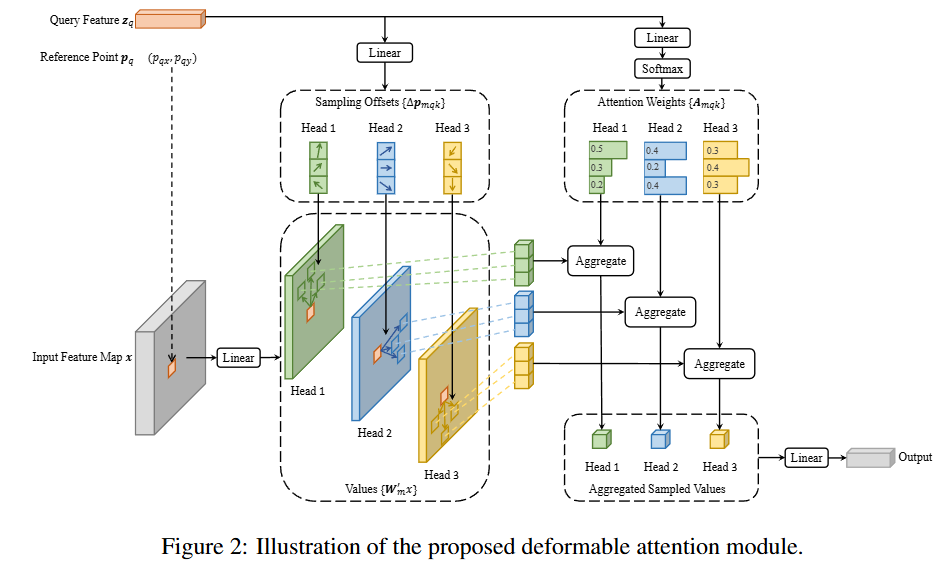
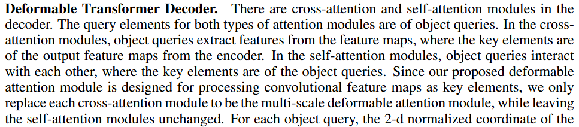

# Deformable DETR

[论文](https://arxiv.org/abs/2010.04159)

## 摘要翻译（GPT）

DETR（Detection Transformer）最近被提出，用以消除目标检测中许多手工设计的组件，同时展现出良好的性能。然而，由于Transformer注意力模块在处理图像特征图时存在局限性，DETR面临着收敛速度慢和特征空间分辨率有限的问题。为了解决这些问题，我们提出了可变形DETR（Deformable DETR），其注意力模块仅关注围绕参考点的一小组关键采样点。与DETR相比，可变形DETR能在训练周期减少10倍的情况下，取得更好的性能（特别是在小物体检测上）。在COCO基准测试上的大量实验结果证明了我们方法的有效性。代码已发布在：https://github.com/fundamentalvision/Deformable-DETR。

## 核心创新点

提出了Deformable Attention，并将其与DETR结合。

## Deformable DETR

### Revisiting Transformers

以下是论文中给出的Multi-head attention公式：
$$
\text{MultiHeadAttn}(z_q, x) = \sum_{m=1}^M W_m \left[ \sum_{k \in \Omega_k} A_{mqk} \cdot W_m' x_k \right]\tag 1
$$

> 吐槽：这个公式什么鬼？就不能用原文中的形式给出吗？

对比原文公式：
$$
\begin{aligned} \text{MultiHead}(Q, K, V) &= \text{Concat}(\text{head}_1, \dots, \text{head}_h) W^O \\ \text{where } \text{head}_i& = \text{Attention}(Q W_i^Q, K W_i^K, V W_i^V) \\
\text{Attention}(Q W_i^Q, K W_i^K, V W_i^V) &= \text{softmax}(QW_i^Q \cdot (KW_i^K)^T / \sqrt{|K|}) VW_i^V
\end{aligned}\tag 2
$$
仔细对比定义：

1. $z_q$ 表示查询向量（$Q$），$x$ 表示输入特征向量（同时对应 $K,V$）。
2. 公式 $(1)$ 将公式 $(2)$ 的Concat操作（也就是多头并行的注意力机制）用求和的形式表示，这里 $m$ 表示 $head_m$，$M$ 则表示head的数量。
3. $\sum_{k \in \Omega_k}$ 表示枚举key vector的下标，$\Omega_k$ 表示所有key vector下标的集合。
4. $A_{mqk}$ 对应于原始scaling dot-product attention中 $\text{softmax}(QW_i^Q \cdot (KW_i^K)^T / \sqrt{|K|})$ 这一部分。具体地，$A_{mqk} \propto \exp\left\{\frac{z_q^T U_m^T V_m x_k}{\sqrt{C_v}}\right\}$，其中 $U_m,V_m$ 可以认为是对应了原始公式中的可学习权重矩阵 $W_i^Q,W_i^K$。
5. $W^\prime_m x_k$ 实际上就是 $VW_i^V$。
6. $W_m$ 就是 $W^O$，作用是将各个头的输出聚合到一起。

### Deformable Attention Module

Deformable Attention的公式如下：
$$
\text{DeformAttn}(z_q, p_q, x) = \sum_{m=1}^M W_m \left[ \sum_{k=1}^K A_{mqk} \cdot W_m' x(p_q + \Delta p_{mqk}) \right]
$$
不难发现，Deformable Attention与Multi-head attention的主要区别就在 $p_q$ 和 $\Delta p_{mqk}$ 上。

这里reference point $p_q$ 是一个全新引入的概念，可以理解为：对于当前这个查询（$z_q$），查询目标的中心点。然后模型再根据这个中心点，计算出卷积核各个点相对于中心点的偏移量（即 $\Delta p_{mqk}$）。

所以，可变形卷积的核心思想就是：卷积核不再是一个方形的矩阵，每一个点都会根据reference point进行一定的偏移（以此来捕捉reference point附近最显著的那些特征点）。

### Multi-scale Deformable Attention Module

大多数现代目标检测框架受益于多尺度特征图，因此本文给出了可变形注意模块自然地扩展到多尺度特征图的方法。

令 $\{x^l\}_{l=1}^L$ 表示多尺度的特征图，$x^l\in\mathbb R^{C\times H_l\times W_l}$，$\hat p_q\in[0,1]^2$ 表示归一化到 $[0,1]^2$ 的reference point坐标，
$$
\text{MSDeformAttn}(z_q, \hat{p}_q, \{x^l\}_{l=1}^L) = \sum_{m=1}^M W_m \left[ \sum_{l=1}^L \sum_{k=1}^K A_{mlqk} \cdot W_m' x^l \left( \phi_l(\hat{p}_q) + \Delta p_{mlqk} \right) \right]
$$
其中，$\phi_l(\cdot)$ 表示根据当前特征图的尺寸还原 $\hat p_q$ 的坐标。

### Deformable Transformer

对于transformer架构中所有的多头注意力机制，Deformable DETR并没有将所有多头注意力机制替换为可变形注意力机制，如下图

Deformable DETR将transformer encoder中的多头注意力机制和decoder中的cross attention部分进行了替换；decoder中的self-attention部分并未替换。

### (TODO:复杂度比较)