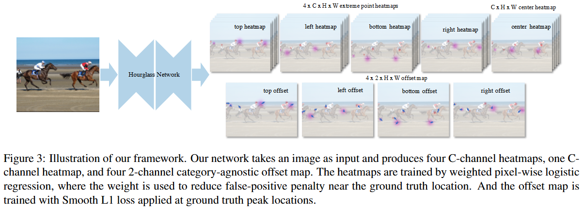

# ExtremeNet

[paper](https://arxiv.org/abs/1901.08043)

[本文前置CornerNet](../CornerNet/cornernet.md)

## 摘要翻译（GPT）

随着深度学习的兴起，目标检测从自下而上的方法转变为自上而下的识别问题。现有的最先进算法列举了几乎穷尽的目标位置列表，并将每个位置分类为：是目标或不是目标。在本文中，我们展示了自下而上的方法依然具有竞争力。我们通过标准的关键点估计网络检测出目标的四个极端点（最上、最左、最下、最右）和一个中心点。然后，如果这些关键点在几何上对齐，我们将这五个关键点分组成一个边界框。目标检测因此变成了一个完全基于外观的关键点估计问题，不需要区域分类或隐式特征学习。我们提出的方法在COCO test-dev上以43.7%的边界框AP与最先进的基于区域的检测方法表现相当。此外，我们估计的极端点直接构成一个粗略的八边形掩膜，Mask AP为18.9%，远超传统边界框的Mask AP。极端点引导的分割进一步将Mask AP提高到34.6%。

## 核心创新点

本文提出的模型是一种自下而上的模型：通过网络求出物体的四个极值点heatmap（最顶部、最左侧、最底部、最右侧的边界点），此外还求出了物体中心的heatmap。然后采用朴素的几何方法求出物体的预测框：$O(N^4)$ 暴力枚举所有极值点的组合（也就是说这里的四个极值点组合出的轮廓不一定是常见的矩形bbox），然后求出该轮廓的几何中心，判断该几何中心在中心点heatmap上是否高于预设的阈值（高于阈值就认为这是一个潜在的物体目标）。这里的 $N$ 不需要取很大的值（文中 $N\le 40$），因此该方法足够高效。

## ExtremeNet

### Architecture

网络的核心架构如图，2D图像经过一个backbone（Hourglass Network）之后输出5个heatmap和4个offset。这里的5个heatmap可以先简单地理解为：前四个heatmap表示图中某一物体可能的4个边界所在点的heatmap（比如top heatmap就是：给出模型检测到的所有可能的物体的上方边界点），而center heatmap则表示某一物体的几何中心的heatmap。

### 