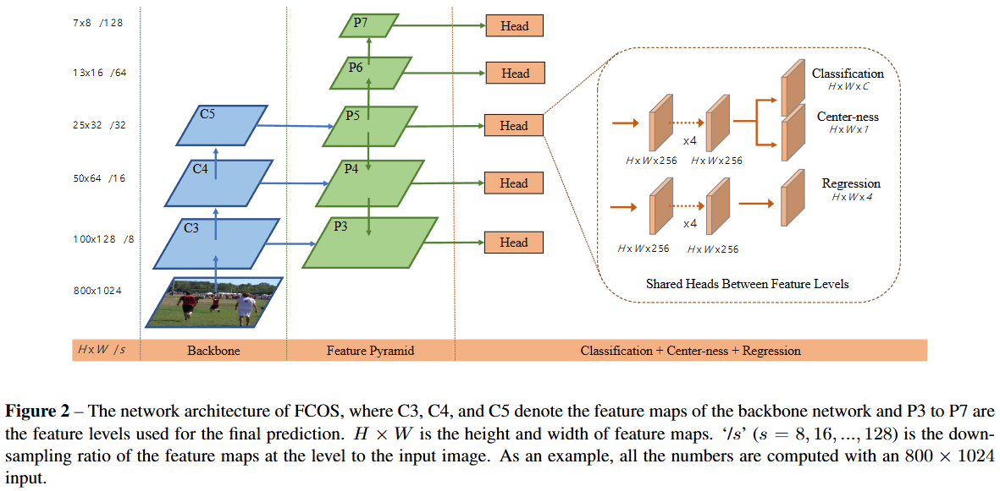
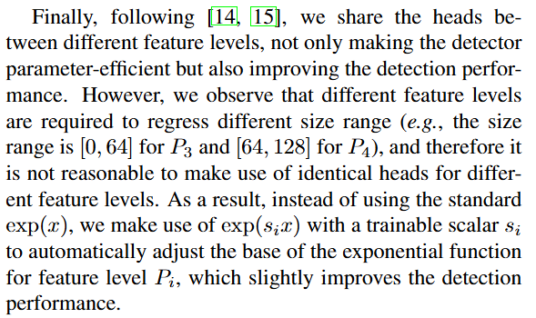
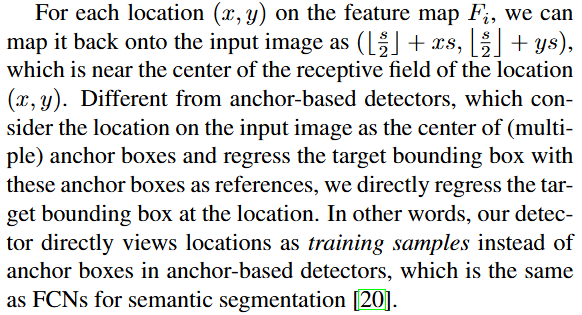
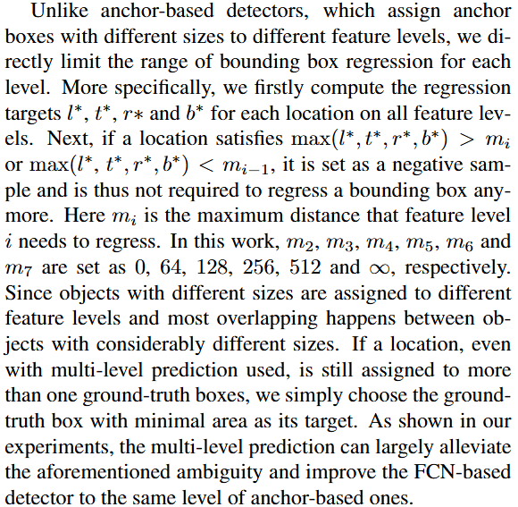
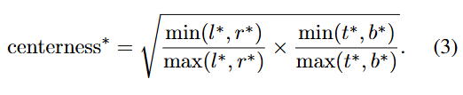
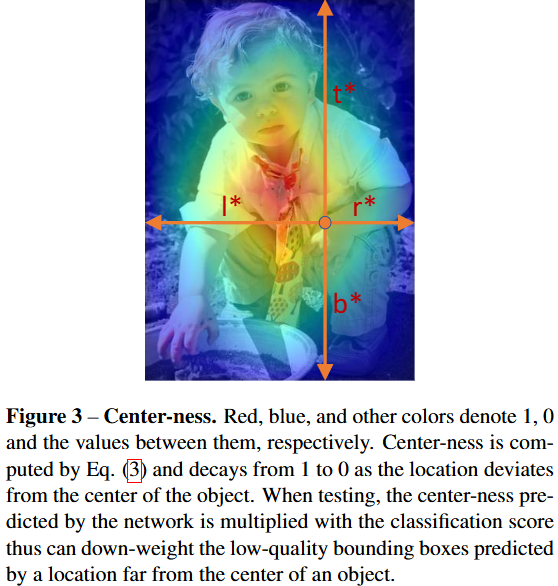

# FCOS

[论文](https://arxiv.org/abs/1904.01355)

## 摘要翻译（GPT）

我们提出了一种完全卷积的单阶段目标检测器（FCOS），通过逐像素预测的方式解决目标检测问题，类似于语义分割。几乎所有的最先进的目标检测器，如 RetinaNet、SSD、YOLOv3 和 Faster R-CNN，都依赖于预定义的锚点框。与之相对，我们提出的检测器 FCOS 不使用锚点框，也不依赖于提议框。通过消除预定义的锚点框集，FCOS 完全避免了与锚点框相关的复杂计算，例如训练过程中计算重叠的操作。更重要的是，我们还避免了所有与锚点框相关的超参数，这些超参数通常对最终的检测性能非常敏感。只使用后处理的非极大值抑制（NMS），FCOS 配合 ResNeXt-64x4d-101 在单模型和单尺度测试中达到了 44.7% 的 AP，超过了之前的单阶段检测器，且其结构更加简单。我们首次展示了一个更简单且灵活的检测框架，实现了更高的检测准确性。我们希望提出的 FCOS 框架能够作为许多其他实例级任务的简单而强大的替代方案。代码可在以下网址获取：

## 核心创新点

提出了一种全新的anchor-free目标检测方法，主要思路是将特征图的每一个像素点都视作某一个检测框的“中心”，然后预测该点对应边界框的四个边界。

## FCOS

### Architecture

如图，FCOS的backbone可以认为就是一个典型的FPN结构；此外按照论文描述，FCOS的五个检测头是“共享的”，也就是共用同一个检测头。

### Fully Convolutional One-Stage Object Detector

令 $F_i\in\mathbb{R}^{H_i\times W_i\times C_i}$ 表示backbone输出的第 $i$ 个特征图，对于特征图 $F_i$ 而言，该特征图上的任意一个像素点都对应一个框。假设该特征图的stride为 $s$，则该特征图上某一点 $(x,y)$ 就可以认为是映射到原图中的像素点 $(\lfloor s/2 \rfloor + xs, \lfloor s/2 \rfloor + ys)$，模型只需要为每一个“中心点”预测该点对应的框的四个边界相对于中心点的偏移距离 $(l,t,r,b)$ 即可。

这也是为什么作者在论文中将本模型与语义分割类比。

此外，FCOS是一个一阶段模型，所以模型会同时输出classification head和(box) regression head。

> 实际上，如图，head还输出了一个center-ness分支，详见后文。

还有一个问题：怎么确定每一个中心点对应框的类别？按照传统的anchor-based方法，我们认为默认框中与GT框iou大于一定阈值的框就是正例，否则为反例。而FCOS则认为如果某一个中心点落在至少一个GT框的范围内，那么这个点就是正例。

那么如果一个点同时落在多个GT框的范围内怎么办？首先模型输出的特征图具有不同的shape，而论文约束了：对于特征图 $F_i$，只有边长在 $[m_{i-1},m_{i}]$ 范围内的预测框才可以成为正例；其次，如果就算这样做了还是出现了某个中心点与多个GT匹配，那么我们就认为这个中心点输出面积较小的那个GT框。如下图，

### Center-ness for FCOS

Center-ness是论文中为了消除低质量预测框所提出的一个概念，公式如下

其中 $(l^*,r^*,t^*,b^*)$ 表示某个中心点预测的四个偏移量。直观理解这个公式，实际上就是在描述：一个框偏离其对应的中心点的量，假设中心点完美落在框的几何中心，那么这个值就会取到最大值1；而框的中心点越偏离其几何中心，则Center-ness越低。

通过这一分支，模型可以快速过滤掉一些从形状上就表现地比较差的，或从语义上表现地比较差的框。