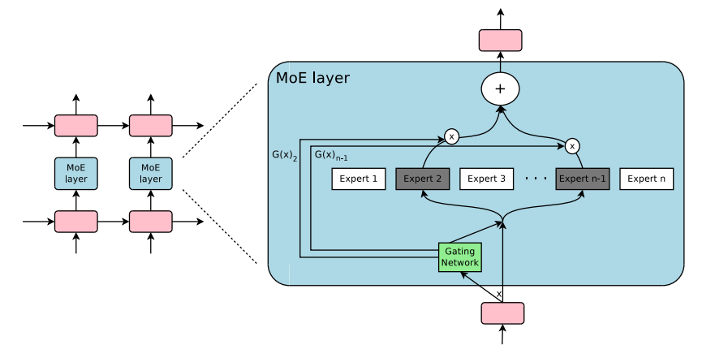

# [Mixture of Experts Explained](https://huggingface.co/blog/moe#what-is-a-mixture-of-experts-moe)

## 什么是专家混合（Mixture of Experts, MoE）？

模型规模是提升模型质量最重要的维度之一。在固定的计算预算下，用较少的训练步数训练一个更大的模型，比用更多步数训练一个较小的模型效果更佳。

专家混合使得模型在预训练时所需的计算大大减少，这意味着在与密集模型相同的计算预算下，你可以显著扩展模型或数据集的规模。具体来说，一个 MoE 模型在预训练阶段应能比其密集模型更快达到相同的质量水平。

那么，MoE 究竟是什么？在 Transformer 模型的背景下，MoE 主要由两个部分构成：

1. **稀疏 MoE 层**
   这些层用于替代密集的前馈网络（FFN）层。MoE 层包含若干个“专家”（例如，8 个），其中每个专家都是一个神经网络。实际上，这些专家通常是 FFN，但它们也可以是更复杂的网络，甚至可以是一个 MoE 本身，从而形成分层 MoE！
2. **门控网络或路由器**
   该组件负责决定将哪些 token 发送给哪个专家。例如，在下图中，token “More” 被发送到第二个专家，而 token “Parameters” 则被发送到第一个网络。如后文所述，一个 token 甚至可以被发送到多个专家。在使用 MoE 时，如何为一个 token 选择合适的专家是一个重大决策——这个路由器由可学习的参数构成，并与网络的其他部分一同预训练。

MoE layer from the [Switch Transformers paper](https://arxiv.org/abs/2101.03961)

总结一下，在 MoE 中，我们将 Transformer 模型的每个前馈网络（FFN）层替换为一个 MoE 层，该层由一个门控网络和若干专家组成。

虽然与密集模型相比，MoE 在预训练时计算效率更高且推理速度更快，但它们也面临一些挑战：

- **训练**：MoE 显著提高了预训练时的计算效率，但在微调过程中往往难以实现良好的泛化，从而容易导致过拟合。
- **推理**：尽管 MoE 模型可能拥有大量参数，但在推理时仅使用其中的一部分，这使得推理速度远快于具有相同参数数量的密集模型。然而，由于所有参数都需要加载到内存中，因此内存需求较高。例如，对于类似 Mixtral 8x7B 的 MoE，我们需要足够的显存来容纳一个密集 47B 参数的模型。为什么不是 8 x 7B = 56B 参数呢？这是因为在 MoE 模型中，仅将 FFN 层视为独立的专家，而其余的模型参数是共享的。同时，假设每个 token 只使用两个专家，其推理速度（FLOPs）相当于使用一个 12B 模型（而不是 14B 模型），因为它计算了 2×7B 的矩阵乘法，但部分层是共享的（后续会详细说明）。

既然我们对 MoE 有了大致的了解，现在让我们来看看促成其发明的研究进展。

## MoE的简史（A Brief History of MoEs）

MoE的根源可以追溯到1991年的论文《Adaptive Mixture of Local Experts》。这个想法类似于集成方法，目的是为一个由多个独立网络组成的系统设计一个监督学习过程，每个网络处理不同子集的训练样本。每个独立的网络，或称为专家，专注于输入空间的不同区域。那么，如何选择专家呢？一个门控网络确定每个专家的权重。在训练过程中，专家和门控网络都会进行训练。

在2010年至2015年之间，两个不同的研究领域为后来的MoE进展做出了贡献：

1. **专家作为组件**：在传统的MoE设置中，整个系统由一个门控网络和多个专家组成。MoE作为整体模型已经在支持向量机（SVM）、高斯过程（Gaussian Processes）等方法中进行了探索。Eigen、Ranzato和Ilya的研究将MoE作为深层网络的组成部分进行了探索。这使得MoE可以作为多层网络中的一层，从而使得模型既能很大又能高效。
2. **条件计算**：传统网络将所有输入数据通过每一层进行处理。在这一时期，Yoshua Bengio研究了根据输入token动态激活或停用网络组件的方法。

这些工作促使了在自然语言处理（NLP）领域中探索专家混合。具体来说，Shazeer等人（2017年，"et al."包括Geoffrey Hinton和Jeff Dean，以及谷歌的Chuck Norris）通过引入稀疏性，将这一想法扩展到137B LSTM（当时NLP领域的事实标准架构，由Schmidhuber创建），即使在高规模下也能保持非常快速的推理。该工作主要集中在机器翻译领域，但也面临许多挑战，如高通信成本和训练不稳定性。

MoE layer from the Outrageously Large Neural Network paper

MoE 使得训练多万亿参数的模型成为可能，例如开源的 1.6T 参数 Switch Transformers 等。MoE 也已在计算机视觉领域得到探索，但本文将重点讨论 NLP 领域。

## 什么是稀疏性？（What is Sparsity?）

稀疏性利用了条件计算的思想。在密集模型中，所有参数都用于所有输入，而稀疏性则允许我们仅运行系统的某些部分。

让我们深入探讨 Shazeer 对 MoE 在翻译任务中的探索。条件计算的思想（即网络的某些部分基于每个示例的情况进行激活）使得可以在不增加计算量的情况下扩大模型的规模，因此，这导致了每个 MoE 层中使用了成千上万的专家。

这种设置引入了一些挑战。例如，尽管较大的批次大小通常对性能更好，但在 MoE 中，由于数据仅通过活跃的专家进行流动，批次大小实际上会减小。例如，如果我们的批处理输入包含 10 个 token，其中 5 个 token 可能会被分配到一个专家，而另外 5 个 token 可能会分配到五个不同的专家，从而导致批次大小不均和资源的低效利用。接下来的 “Making MoEs go brrr” 部分将讨论其他挑战及解决方案。

我们如何解决这个问题？一个学习到的门控网络（G）决定将输入的某些部分发送到哪些专家（E）：
$$
y = \sum_{i=1}^{n} G(x)_iE_i(x)
$$
